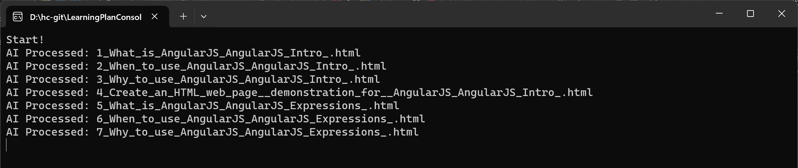
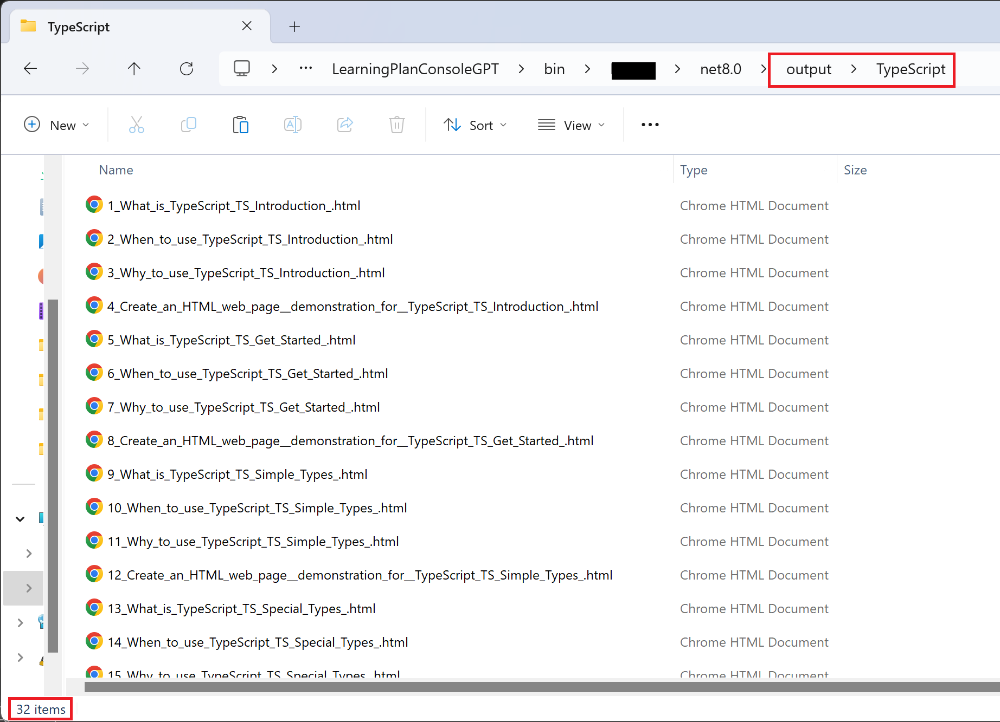

# LearningPlanConsoleGPT - Azure AI Console Application

## Overview

This AI Console application is developed in .NET 8 and utilizes Azure AI Service to provide responses to tons of questions on a specified subject and topic. The application is designed to efficiently handle large sets of questions and write corresponding responses to configured output file with extensions.

## Prerequisites

Before running the application, ensure that you have the following prerequisites installed:

- .NET 8 SDK: [Download .NET 8](https://dotnet.microsoft.com/download/dotnet/8.0)
- Azure AI Service credentials: Obtain Azure AI Service credentials and replace them in the configuration file.

## Configuration

1. Open the `appsettings.json` file.
2. Replace `AzureAIKey`, `AzureAIUrl` and  `YourGithubAlias` with your Azure AI Service key, endpoint and YourGithubAlias.
3. Configure other settings such as the `SubjectListFilePath`, `AiQuestionFilePath`, and `AiOutPutDirPathText` as needed.

    ```App.config
    <?xml version="1.0" encoding="utf-8" ?>
    <configuration>
    	<appSettings>
    		<!--Azure AI Credentials-->
    		<add key="AzureAIUrl" value="" />
    		<add key="AzureAIKey" value="" />
    		<add key="YourGithubAlias" value="" />
    
    		<!--Input-->
    		<add key="SubjectListFilePath" value="user-input\want-to-learn.json" />
    		<add key="AiQuestionFilePath" value="user-input\raw-questions.json" />
    		
    		<!--Output-->
    		<add key="AiOutPutDirPathText" value="output" />
    		
    	</appSettings>
    </configuration>
    ```

4. `want-to-learn.json` sample json as below 

        ```want-to-learn.json
            [
              {
                "Subject": "TypeScript",
                "Topics": [
                  "TS Introduction",
                  "TS Get Started",
                  "TS Simple Types",
                  "TS Special Types",
                  "TS Arrays",
                  "TS Tuples",
                  "TS Object Types",
                  "TS Enums"
                ]
              }
            ]
        ```

  5. `raw-questions.json` What questions arise in the mind when acquiring knowledge about new technology? sample json as below 
   
        ```raw-questions.json
        [
          {
            "Question": "What is {0} {1}?",
            "FileExtension": "html"
          },
          {
            "Question": "When to use {0} {1}?",
            "FileExtension": "html"
          },
          {
            "Question": "Where to use {0} {1}?",
            "FileExtension": "html"
          },
          {
            "Question": "Who will use {0} {1}?",
            "FileExtension": "html"
          },
          {
            "Question": "Why to use {0} {1}?",
            "FileExtension": "html"
          },
          {
            "Question": "Create an HTML web page, demonstration for  {0} {1}?",
            "FileExtension": "html"
          }
        ]
        ```
        Note: In raw-questions.json file - {0} = Subject and {1} = Topic
  
 ## Usage
 Build the application:
 ```console
 dotnet build
 ```

 Run the application:
```console
 dotnet run
```

Follow the on-screen prompts -  It will show the output file name with its corresponding extension.

## Output
The application will process the questions using Azure AI Service and save the responses to files with the specified file extension.

1. Application Started, screen as below


2. Write AI responses in respective files on configured path, screen as below
 

3. Application end, screen as below
 
Note: You can found the save the responses in `output` (`ApplicationCurrenetDirectory\output`) directory.